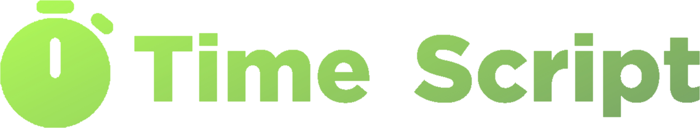

### 🖼️ - Preview

> 

### 📄 - Script

```lua
local time = loadstring(game:HttpGet("https://raw.githubusercontent.com/AlikSusFootages/TimeScript/main/file.lua"))()

local font = "YOUR FONT"

local ui = time:CreateTimer({Font = font})
```

### 💬 - Fonts

DOCS: https://create.roblox.com/docs/reference/engine/enums/Font


| Name | Value |
|------------|------------|
| Legacy | 0 |
| Arial | 1 |
| ArialBold | 2 |
| SourceSans | 3 |
| SourceSansBold | 4 |
| SourceSansLight | 5 |
| SourceSansItalic | 6 |
| Bodoni | 7 |
| Garamond | 8 |
| Cartoon | 9 |
| Code | 10 |
| Highway | 11 |
| SciFi | 12 |
| Arcade | 13 |
| Fantasy | 14 |
| Antique | 15 |
| SourceSansSemibold | 16 |
| Gotham | 17 |
| GothamMedium | 18 |
| GothamBold | 19 |
| GothamBlack | 20 |
| AmaticSC | 21 |
| Bangers | 22 |
| Creepster | 23 |
| DenkOne | 24 |
| Foundamento | 25 |
| FredokaOne | 26 |
| GrenzeGotisch | 27 |
| IndieFlower | 28 |
| JosefinSans | 29 |
| Jura | 30 |
| Kalam | 31 |
| LuckiestGuy | 32 |
| Merriweather | 33 |
| Michroma | 34 |
| Nunito | 35 |
| Oswald | 36 |
| PatrickHand | 37 |
| PermanentMarker | 38 |
| Roboto | 39 |
| RobotoCondensed | 40 |
| RobotoMono | 41 |
| Sarpanch | 42 |
| SpecialElite | 43 |
| TitilliumWeb | 44 |
| Ubuntu | 45 |
